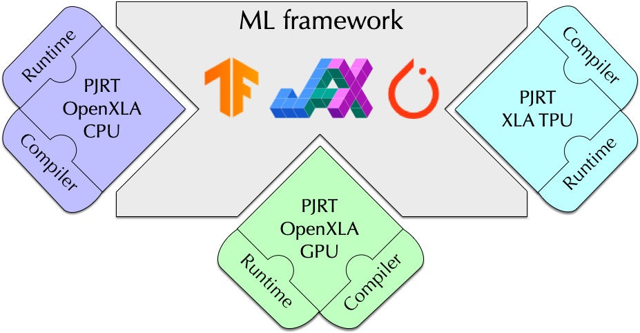
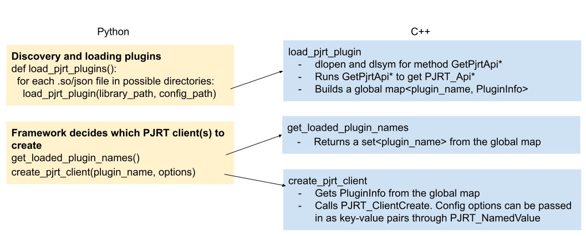

## RFC: OpenXLA PJRT Plugin

| Status        | Proposed                                                |
| :------------ | :------------------------------------------------------ |
| **RFC #**     | [33](https://github.com/openxla/community/pull/33) |
| **Author(s)** | Skye Wanderman-Milne (skyewm@google.com), Jieying Luo (jieying@google.com), Jacques Pienaar (jpienaar@google.com) |
| **Sponsor**   | Stella Laurenzo (laurenzo@google.com), James Rubin (jamesrubin@google.com) |
| **Updated**   | 2023-01-23                                              |

## Objective

*   Framework integration of a packaged compiler and runtime solution;

## Proposal

*   Adopt PJRT as the supported device plugin mechanism for OpenXLA;
*   Create new repo openxla/openxla-pjrt-plugin for the OpenXLA PJRT plugin;

## Background: PJRT

[PJRT](https://github.com/tensorflow/tensorflow/blob/master/tensorflow/compiler/xla/pjrt/c/pjrt_c_api.h)
is a uniform Device API that we want to add to the OpenXLA ecosystem. The long
term vision for PJRT is that: (1) frameworks (TensorFlow, PyTorch, JAX, etc.)
will call PJRT, which has device-specific implementations that are opaque to the
frameworks; (2) each device focuses on implementing PJRT APIs, and can be opaque
to the frameworks.


<p align = "center"> PJRT provides a platform independent interfacing for
compilers and corresponding runtimes. </p>

PJRT API will provide an easy interface with which frameworks can integrate a
packaged compiler and runtime solution. It will be the supported interface that
will be used by TensorFlow and JAX for all compiler and runtime integration. And
as such it will be easy for other compilers and runtimes that implement the PJRT
interface to integrate with these systems.

## PJRT plugin mechanism goal

The PJRT plugin mechanism should support the following features:

*   Different devices (e.g. TPU, GPU) can have different implementations
    (through
    [PJRT C API interface](https://github.com/tensorflow/tensorflow/blob/master/tensorflow/compiler/xla/pjrt/c/pjrt_c_api.h)).
*   Registration of multiple PJRT plugins.
*   Loading multiple PJRT plugins (e.g. both CPU and TPU) in the same process.
*   Passing configuration values from client (e.g. JAX lib) or from json files
    provided by the plugin (default configs).
*   Plugin discovery and choosing which plugins to load.

## High level plugin structure



## Current Status

As of Dec 14, 2022

*   [LoadPjrtPlugin(plugin_name, library_path)](https://github.com/tensorflow/tensorflow/blob/master/tensorflow/compiler/xla/stream_executor/tpu/pjrt_api.cc#L73)
    can be used to load a PJRT plugin. We also provide a Python method
    [load_pjrt_plugin](https://github.com/tensorflow/tensorflow/blob/master/tensorflow/compiler/xla/python/xla.cc#L329)
    binded to it.
*   [GetCApiClient(plugin_name)](https://github.com/tensorflow/tensorflow/blob/master/tensorflow/compiler/xla/pjrt/pjrt_c_api_client.cc#L1150)
    can be used to create a PJRT client. We also provide a Python method
    [get_c_api_client](https://github.com/tensorflow/tensorflow/blob/master/tensorflow/compiler/xla/python/xla.cc#L391)
    binded to it.

## Design Considerations

### <a name="heading=h.782ksg6rl5bj"></a> Loading plugins

We will provide a low level C++ method to load a PJRT plugin, which takes
`library_path` and `config_values` as inputs. A python method `load_pjrt_plugin`
binded to it will be provided as well.

```c++
Status LoadPjrtPlugin(string library_path, map<string, string> config_values) {
  library_handle = dlopen(library_path);
  function_prt = dlsym(library_handle, "GetPjrtApi");
  if (function_prt != nullptr) {
     PJRT_Api* api = function_prt();
     plugin_name = parse(library_path);
     if (auto it = global_pjrt_plugin_map.find(plugin_name);
         it != global_pjrt_plugin_map.end()) {
       // Allows to the same plugin multiple times.
       return;
     }
     PluginInfo plugin_info(api, config_values);
     global_pjrt_plugin_map[plugin_name] = plugin_info;
  }
}
```

*   `GetPjrtApi` returns a `PJRT_Api*` pointer that contains the implementation
    of the C APIs.
*   `global_pjrt_plugin_map` is a global `map<plugin_name, PluginInfo>` with the
    same lifetime as the program
*   `plugin_name` has the same meaning as `platform_name` in JAX.
*   To be able to store the config values, and be future-proofed for other
    information such as version, we propose to use a class PluginInfo. This
    class is immutable after constructed, and contains getter method for
    `PJRT_Api*` and config values.

### Discovering and automatic loading plugins

To allow framework users to pip-install plugins without requiring further code
changes, we'll implement a Python discovery mechanism to automatically find and
load plugins. The plugin discovery will be based on the
[naming convention of the Python module](https://packaging.python.org/en/latest/guides/creating-and-discovering-plugins/#using-naming-convention),
and full paths set in the environment variable `PJRT_PLUGIN_LIBRARY_PATH` which
is added to allow users to manually specify directories and/or .so files). For
modules found, it will be imported.

*   Tentative naming convention for .so/json files:
    "pjrt-plugin-<plugin_name>.so" or "pjrt-plugin-<plugin_name>.json".

There are two options to automatically load plugins (decision has not been made
yet):

Option 1: Plugin module updates PJRT_PLUGIN_LIBRARY_PATH on import. A python
method `load_pjrt_plugins` will be added to discover .so/json files related to
PJRT plugins and load them.

```python
def load_pjrt_plugins():
  for directory in env[PJRT_PLUGIN_LIBRARY_PATH]:
    if json file:
      Library_path, config_values = parse json file
      load_pjrt_plugin(library_path, config_values)
    elif .so file:
      load_pjrt_plugin(.so file path)
```

Option 2: Plugin module is responsible for calling
[load_pjrt_plugin](#heading=h.782ksg6rl5bj) with its default options on import.

Open questions:

*   Are there requirements about what file should not be loaded?

### <a name="heading=h.396bmv8gkskz"></a> Create PJRT client(s)

Frameworks decide which PJRT clients to create and use. For example, a framework
can create PJRT clients for all the plugins loaded. It can also choose to only
create a subset of PJRT clients based on some priorities rules. It can also come
from the user configuration.

Two python methods binding to C++ methods will be provided to facilitate
creating PJRT clients:

1.  `get_loaded_plugin_names()` which gets all loaded plugin names from
    `global_pjrt_plugin_map`.
2.  `create_pjrt_client(plugin_name)` which creates a PJRT C API client (similar
    to
    [GetCApiClient](https://github.com/tensorflow/tensorflow/blob/master/tensorflow/compiler/xla/pjrt/pjrt_c_api_client.cc#L1150)).
    It will retrieve the PluginInfo stored in `global_pjrt_plugin_map` and run
    `PJRT_Client_Create` (see
    [Config values for creating PJRT client(s)](#heading=h.bjuf0soco0sj)
    section).

Open questions:

*   What about plugin initialization that are not related to creating a PJRT
    client? For example, these two functions in
    [tpu_initializer_helper.cc](https://github.com/tensorflow/tensorflow/blob/master/tensorflow/compiler/xla/stream_executor/tpu/tpu_initializer_helper.cc#L269-L270)
    should be run when initializing TPU. Currently they are called every time a
    PJRT TPU client is created. One solution is to place this initizliation in 
    method `GetPjrtApi`. It will run the first time that a plugin is loaded.
*   It is not desired to create PJRT clients for every plugin that is found as
    that will increase resource utilization. Framework decides what behavior
    they prefer.
    *   We may need to store loaded PluginInfo in a nested map `map<device_type,
        <plugin_name, PluginInfo>>` if the framework wants to know what plugins
        are available for a device (e.g. current PJRT GPU and IREE GPU) and only
        create one PJRT client per device.

### <a name="heading=h.bjuf0soco0sj"></a> Config values for creating PJRT client(s)

GetCApiClient will be changed to take a map of config values. This map can be
passed to `PJRT_Client_Create` through
[PJRT_NamedValue](https://github.com/tensorflow/tensorflow/blob/master/tensorflow/compiler/xla/pjrt/c/pjrt_c_api.h#L210).
The default config values can (1) come from the json file which will be stored
in PluginInfo, or (2) plugin implementation during import.

### Framework integration

All the methods mentioned above can be reused across frameworks. For example,
JAX lib can integrate as follows:

*   Call [load_pjrt_plugins](#heading=h.782ksg6rl5bj) when
    [initializing backends](https://github.com/google/jax/blob/a66b3dcdd378b723e275a19258de826260b4c83e/jax/_src/lib/xla_bridge.py#L381).
*   Call [get_loaded_plugin_names](#heading=h.396bmv8gkskz) to get loaded PJRT
    `plugin_name`, have some framework specific logics to decide whether to call
    [create_pjrt_client](#heading=h.396bmv8gkskz) to create the PJRT client.

```python
def create_pjrt_clients():
  loaded_plugin_names = get_loaded_plugin_names()
  for plugin_name in loaded_plugin_names:
    # Framework specific logics to decide whether to create
    if should_create_pjrt_client(plugin_name):
      pjrt_client = create_pjrt_client(plugin_name)
```

For TensorFlow, discovery will be added to
[here](https://github.com/tensorflow/tensorflow/blob/master/tensorflow/api_template.__init__.py#L142),
and loading PJRT plugins will be added to
[here](https://github.com/tensorflow/tensorflow/blob/master/tensorflow/core/common_runtime/pluggable_device/pluggable_device_plugin_init.cc#L124).
Depending on the plugin, the client can be created implicitly in the first time
it is used, or created in a plugin custom op kernel. Created PJRT clients will
be saved in the
[global TensorFlow ResourceManager](https://github.com/tensorflow/tensorflow/blob/master/tensorflow/core/tfrt/common/pjrt_util.h#L26).

Whether multiple frameworks can create a client for the same device is up to the 
specific hardware and plugin implementation. If the hardware only allows
exclusive access, then the software will abide by that constraint. Otherwise,
some plugins may use the hardware in an exclusive way (ie. allocate all memory).
The openxla plugin that we envision now will default to allowing multiple clients
and supporting on demand memory allocation (with a possible option for more greedy
access as an optimization for cases that need it).

For more information about PJRT, please consult the PJRT
[C header](https://github.com/tensorflow/tensorflow/blob/master/tensorflow/compiler/xla/pjrt/c/pjrt_c_api.h),
[C++ header](https://github.com/tensorflow/tensorflow/blob/master/tensorflow/compiler/xla/pjrt/pjrt_client.h),
[plugin mechanism design doc](https://docs.google.com/document/d/1FieBwiflD6DT9Z38wFIrnNxrUto1AOP3UuibQ4vpvEQ/edit)
and
[integration guide](https://docs.google.com/document/d/1EL62DkASMFZbk89K6MIPNGUFBTbkC21v5-uL5fB8VsM/edit).

## Open questions and future improvments from the comments
*   Windows support.
*   Test suites for PJRT implementations.
*   How to handle versioning or variants (e.g. x86, x86-64 and ARM CPUs, different
    CUDA compute capability GPUs, DPUs, etc.).
*   How does a device broadcast its capability or supported API calls?
*   Support unload and reload a PJRT plugin (hot-swap/plug).
*   Single vs Multi-process access/ ownership (maybe covered by IRFT).
*   Command queues/buffer management APIs access, simple commands vs. transactional.

## Initial contribution

We will use the plugin in
[IREE samples](https://github.com/iree-org/iree-samples/tree/main/pjrt-plugin)
to seed the repo and build full PJRT support as part of OpenXLA project.
